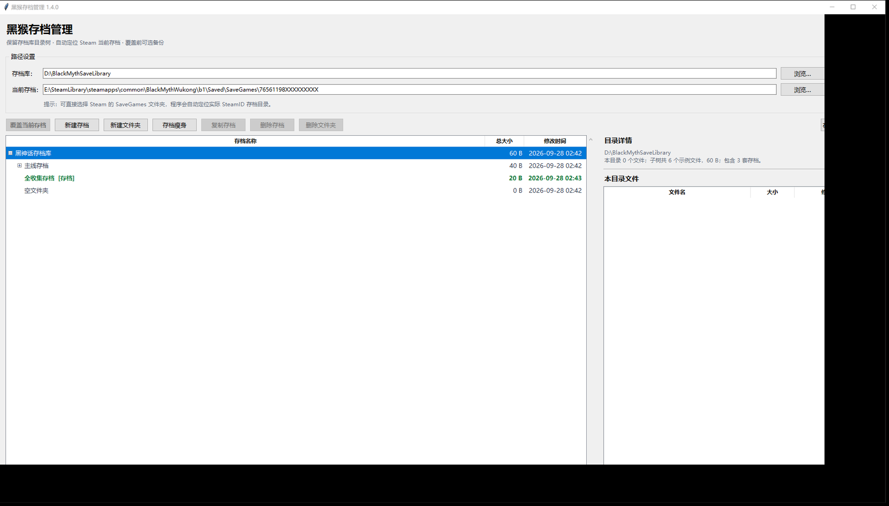
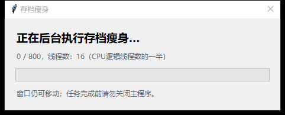

# 黑猴存档管理

一个面向 Windows 的《黑神话：悟空》存档管理 GUI。用于浏览、备份、覆盖、整理和瘦身本地存档，不修改游戏本体。



## 功能

- 自动扫描 Steam 库，定位 `SaveGames\SteamID` 当前存档目录
- 保留存档库原有目录树，空文件夹也会显示
- 覆盖当前存档，覆盖前可选备份；不会覆盖 `UserSettingSaveGame.sav`
- 游戏运行时也可执行覆盖，并提示回到标题界面重新加载
- 新建存档、新建空文件夹、复制、删除、重命名
- 支持删除不含任何 `.sav` 的普通文件夹
- 存档瘦身：每个目录只保留 `ArchiveSaveFile.2.sav`
- 瘦身使用 `CPU逻辑线程数 ÷ 2` 的线程池，后台执行，不阻塞界面
- 删除优先移入 Windows 回收站
- 完整右键菜单
- Per-Monitor V2 DPI 适配
- 自动保存上次使用的存档库和当前存档路径

## 界面截图

### 主界面


### 存档瘦身进度



## 运行

要求：

- Windows 10 / 11
- Python 3.10+（从源码运行时）

安装后运行：

```powershell
python -m pip install .
black-myth-save-manager
```

也可以直接运行源码：

```powershell
python src/black_myth_save_manager.py
```

## 构建单文件 EXE

```powershell
.\build.ps1
```

输出：

```text
dist\BlackMythSaveManager.exe
```

构建脚本会自动安装 PyInstaller，并嵌入 DPI 感知清单。

## 使用说明

1. 启动程序。
2. 选择存档库根目录，例如：
   ```text
   D:\Downloads\黑猴存档
   ```
3. 程序会自动寻找当前存档：
   ```text
   ...\BlackMythWukong\b1\Saved\SaveGames\SteamID
   ```
4. 在左侧选择标记为 `[存档]` 的目录。
5. 点击“覆盖当前存档”，选择是否先备份。

存档库路径和当前存档路径会保存到：

```text
%APPDATA%\BlackMythSaveManager\settings.json
```

备份保存在：

```text
%LOCALAPPDATA%\BlackMythSaveManager\Backups
```

## 存档瘦身

瘦身会递归处理所选目录：

- 保留每个目录中的 `ArchiveSaveFile.2.sav`
- 其他文件移入 Windows 回收站
- 空文件夹和目录层级保留
- 使用批量回收站操作和后台线程池
- 默认线程数为 `CPU逻辑线程数 ÷ 2`
- 支持实时进度显示

## 项目结构

```text
.
├── assets/screenshots/       # README 截图
├── packaging/app.manifest    # Windows DPI / 长路径清单
├── src/
│   └── black_myth_save_manager.py
├── tests/self_check.py       # 最小可运行自检
├── build.ps1
├── pyproject.toml
└── README.md
```

## 自检

```powershell
python tests/self_check.py
```

## 安全说明

- 覆盖、删除和瘦身操作前请确认目标目录。
- 删除和瘦身默认使用 Windows 回收站，不会直接永久删除。
- 覆盖采用完整镜像替换，而不是简单覆盖同名文件。
- 游戏运行时覆盖后，请回到标题界面重新读取存档。
- 请先备份重要存档，再执行批量操作。

## 免责声明

本项目是非官方工具，与游戏开发商、发行商及 Steam 无关。使用本项目造成的存档丢失、损坏或其他风险由使用者自行承担。

## License

[MIT](LICENSE)
